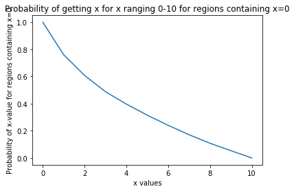
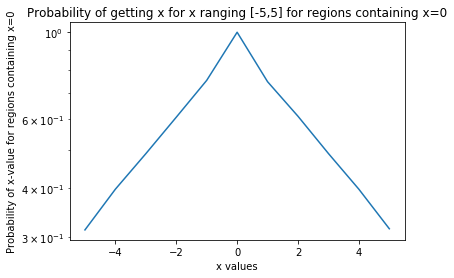
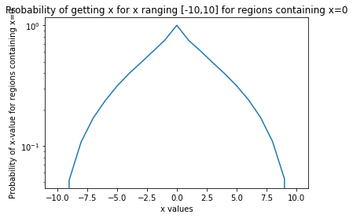
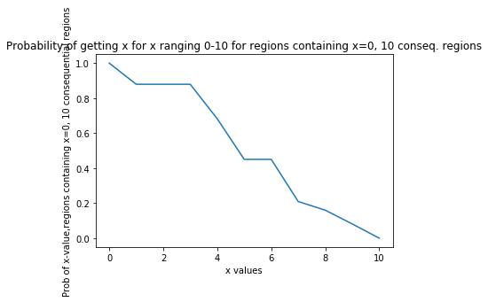
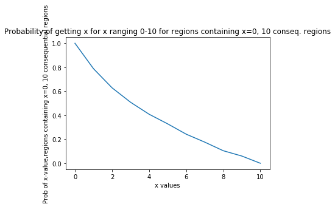

Homework 6--Universal Law of Generalization

Problem 1


```python
import numpy as np
import matplotlib.pyplot as plt

```


```python
def contains(region,point):
    if point >= region[0] and point <= region[1]:
        return True
    else:
        return False
print(contains([1,5],6))
print(contains([1,10],3))
```

    False
    True


Problem 2


```python
#Probability of getting x=1 for regions containing x=0
#This creates the regions
list_of_regions = []
for i in range(10000):
    randInt1 = np.random.uniform(-10,0)
    randInt2 = np.random.uniform(0,10)
    region_one = [randInt1,randInt2]
    list_of_regions.append(region_one)

def prob_getting_x(x,point,regions):
    count_x = 0
    count_point = 0
    for i in range(len(list_of_regions)):
        if contains(list_of_regions[i],point):
            count_point += 1/(abs(list_of_regions[i][1] - list_of_regions[i][0]))
            if contains(list_of_regions[i],x):
                count_x += 1/(abs(list_of_regions[i][1]-list_of_regions[i][0]))
    return count_x/count_point
print("The probability of getting x=1 for regions containing x=0 is",100*prob_getting_x(1,0,list_of_regions))
```

    The probability of getting x=1 for regions containing x=0 is 75.98777374562778


Problem 3


```python
#Probability of getting x for x ranging between 0-10 for regions containing x=0
list_of_probs = []
x_vals = [0,1,2,3,4,5,6,7,8,9,10]
for i in range(0,11):
    prob_this_x = prob_getting_x(i,0,list_of_regions)
    list_of_probs.append(prob_this_x)
print(len(list_of_probs))
plt.plot(x_vals,list_of_probs)
#plt.yscale('log')
plt.xlabel('x values')
plt.ylabel('Probability of x-value for regions containing x=0')
plt.title('Probability of getting x for x ranging 0-10 for regions containing x=0')
plt.show() 
```

    11





This graph makes sense because as you get farther away from the x-value of 0 (a stimulus), the probability of a certain other x-value being in a region containing the stimulus decreases. For example, an x-value of 1 has a high probability of being in a region that contains x-value of 0, but 9 has a much lower probability for this.

Problem 4

We can check the exponential nature of a curve by using log of the y-axis. If you take the log of an exponential function, you will get a straight line, based on their respective equations. 

Problem 5


```python
#Plotting with log y-axis with x [-5,5] and x [-10,10].
#x in [-5,5]
list_of_probs = []
x_vals = [i for i in range(-5,6)]
for i in range(-5,6):
    prob_this_x = prob_getting_x(i,0,list_of_regions)
    list_of_probs.append(prob_this_x)
plt.plot(x_vals,list_of_probs)
plt.yscale('log')
plt.xlabel('x values')
plt.ylabel('Probability of x-value for regions containing x=0')
plt.title('Probability of getting x for x ranging [-5,5] for regions containing x=0')
plt.show() 

#x in [-10,10]
list_of_probs = []
x_vals = [i for i in range(-10,11)]
for i in range(-10,11):
    prob_this_x = prob_getting_x(i,0,list_of_regions)
    list_of_probs.append(prob_this_x)
plt.plot(x_vals,list_of_probs)
plt.yscale('log')
plt.xlabel('x values')
plt.ylabel('Probability of x-value for regions containing x=0')
plt.title('Probability of getting x for x ranging [-10,10] for regions containing x=0')
plt.show() 
```








These graphs show that there's two clear straight lines in the x ranging [-5,5] but not in the x ranging [-10,10]. Because these are overlapping ranges, we can surmize that part of the x [-10,10] graph is exponential (between [-5,5]) but the other parts of the graph are not. This means the other parts are not decreasing or increasing at as fast a rate as the exponential parts.

Problem 6


```python
#Using 10 consequential regions
list_of_regions = []
list_of_prob_10 = []
for i in range(10):
    randInt1 = np.random.uniform(-10,0)
    randInt2 = np.random.uniform(0,10)
    region_one = [randInt1,randInt2]
    list_of_regions.append(region_one)
x_vals = [i for i in range(0,11)]
for i in range(0,11):
    prob_this_x = prob_getting_x(i,0,list_of_regions)
    list_of_prob_10.append(prob_this_x)
plt.plot(x_vals,list_of_prob_10)
#plt.yscale('log')
plt.xlabel('x values')
plt.ylabel('Prob of x-value,regions containing x=0, 10 consequential regions')
plt.title('Probability of getting x for x ranging 0-10 for regions containing x=0, 10 conseq. regions')
plt.show()
```





```python
#100 consequential regions
list_of_regions = []
list_of_prob_100 = []
for i in range(100):
    randInt1 = np.random.uniform(-10,0)
    randInt2 = np.random.uniform(0,10)
    region_one = [randInt1,randInt2]
    list_of_regions.append(region_one)
x_vals = [i for i in range(0,11)]
for i in range(0,11):
    prob_this_x = prob_getting_x(i,0,list_of_regions)
    list_of_prob_100.append(prob_this_x)
plt.plot(x_vals,list_of_prob_100)
#plt.yscale('log')
plt.xlabel('x values')
plt.ylabel('Prob of x-value,regions containing x=0, 10 consequential regions')
plt.title('Prob of getting x for x ranging 0-10 for regions containing x=0, 10 conseq. regions')
plt.show()
```


```python
#1000 consequential regions
list_of_regions = []
list_of_prob_1000 = []
for i in range(1000):
    randInt1 = np.random.uniform(-10,0)
    randInt2 = np.random.uniform(0,10)
    region_one = [randInt1,randInt2]
    list_of_regions.append(region_one)
x_vals = [i for i in range(0,11)]
for i in range(0,11):
    prob_this_x = prob_getting_x(i,0,list_of_regions)
    list_of_prob_1000.append(prob_this_x)
plt.plot(x_vals,list_of_prob_1000)
#plt.yscale('log')
plt.xlabel('x values')
plt.ylabel('Prob of x-value,regions containing x=0, 10 consequential regions')
plt.title('Probability of getting x for x ranging 0-10 for regions containing x=0, 10 conseq. regions')
plt.show()
```





As you add more consequential regions, the slopes of the curves become more straight. As there are more regions added, the probbility of one x-value being in the region with x=0 becomes more similar to this probability for the x+/- 1 value. More consequential regions allow for more smooth data. With fewer consequential regions, there is probably more clear distinctions being made.

Problem 7

In this kind of generalization, there could be different numbers of consequential regions made. You could test the types/number of distinctions people make and how they categorize. In a more data-based approach though, you could look at the slopes of the curves. As established above, with more consequential regions mean less distinct categorization; but humans must use some appropriate level of distinction between entities, so looking at when the slope of the curves stops changing could be indicative of this. There is a large difference in slopes of 10 and 10,000 consequential regions but less of a difference in slopes between 10,000 and 20,000 regions. Searching for the point at which the slope stops changing could be indicative of the point which humans use in this kind of generalization.


```python

```
